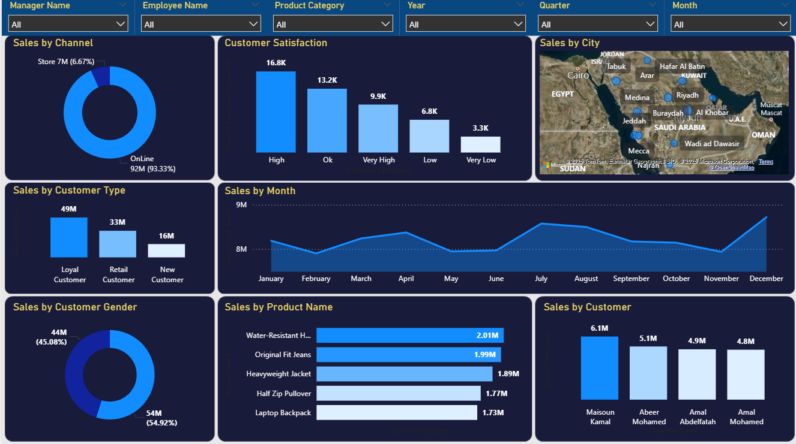

# Sales-Data-Analysis-Dashboard
# 📊 Sales Data Analysis Dashboard – Power BI Project

This project is an interactive **Sales Dashboard** built using **Power BI** and **Excel**. It provides a comprehensive view of sales performance across different dimensions such as managers, employees, products, customer types, channels, and time periods.

This project was created to develop and demonstrate skills in data analysis, reporting, and interactive visualization. It reflects the ability to build insightful dashboards that support data-driven decision-making.

---

## 📝 Project Description

This dashboard allows users to analyze sales data from multiple angles using dynamic filters. It supports decision-making by offering clear visuals, KPIs, and insights into customer behavior and product performance.

---

## 📁 Project Contents

- `Sales-Data-Analysis-Dashboard.xlsx` – Excel file containing the raw sales data.
- `Sales-Data-Analysis-Dashboard.pbix` – Power BI report with fully interactive dashboards.
- `README.md` – This file.

---

## 🛠️ Tools Used

- Microsoft Excel (for raw data)
- Power BI Desktop (for data modeling and visualization)
- DAX (for KPIs and calculations)

---

## 🔍 Key Features

- Filter and analyze sales by:
  - **Manager Name**
  - **Employee Name**
  - **Product Category**
  - **Year** *(from 2020 onward)*
  - **Quarter**
  - **Month**
- Explore sales by:
  - **Channel** (Online vs Store)
  - **Customer Type** (Loyal, Retail, New)
  - **Customer Gender**
  - **City** (Map-based view)
- View trends and KPIs:
  - Monthly sales trends
  - Top-selling products
  - Top customers
  - Customer satisfaction levels

---

## ▶️ How to Use

1. Open the `.pbix` file using Power BI Desktop.
2. Use the dashboard slicers (filters) to explore data.
3. Analyze sales performance and customer behavior.
4. Extend or customize the dashboard as needed.

---

## 🧾 Notes

- The data in this project is for **learning and practice purposes** only.
- This project demonstrates skills in data analysis, reporting, and dashboard design using Power BI and Excel.
- Feel free to fork, clone, or build upon this project for your own learning or portfolio.

---

## 🖼️ Dashboard Preview

---

## 👨‍💻 Developed By

This project was developed as part of a personal initiative to enhance skills in business intelligence, Power BI, and data storytelling.

---
## 🖼️ Dashboard Screenshot

